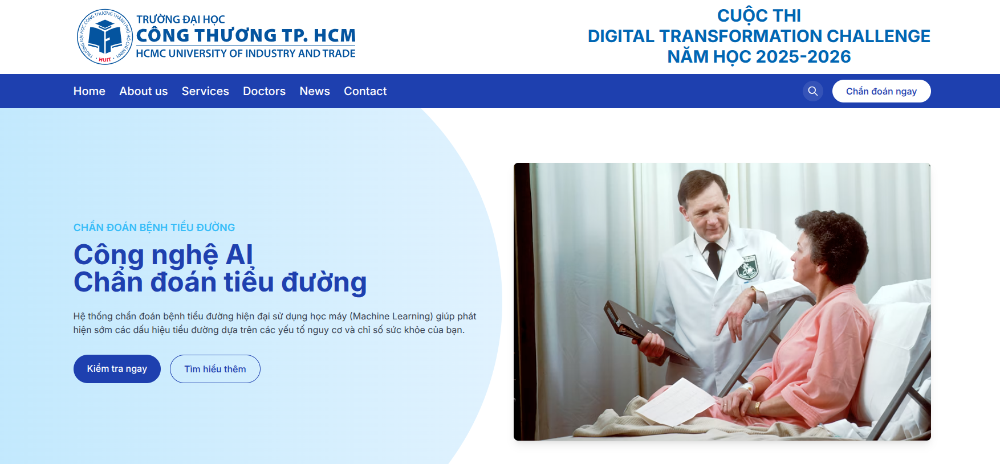
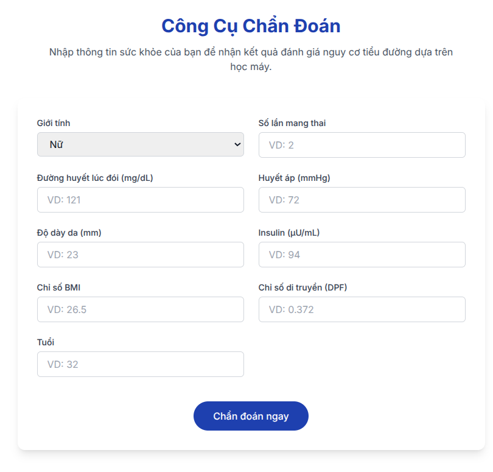
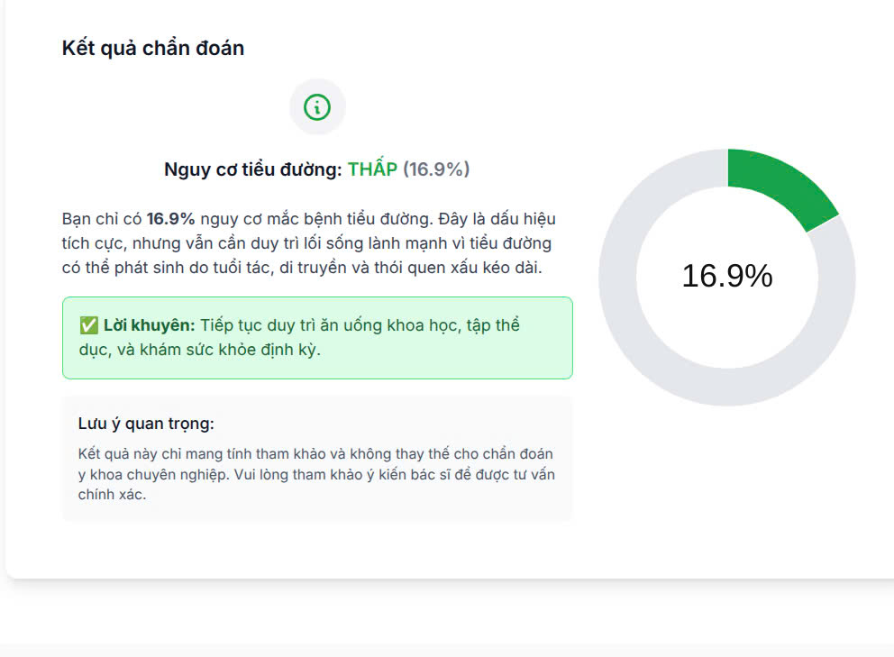
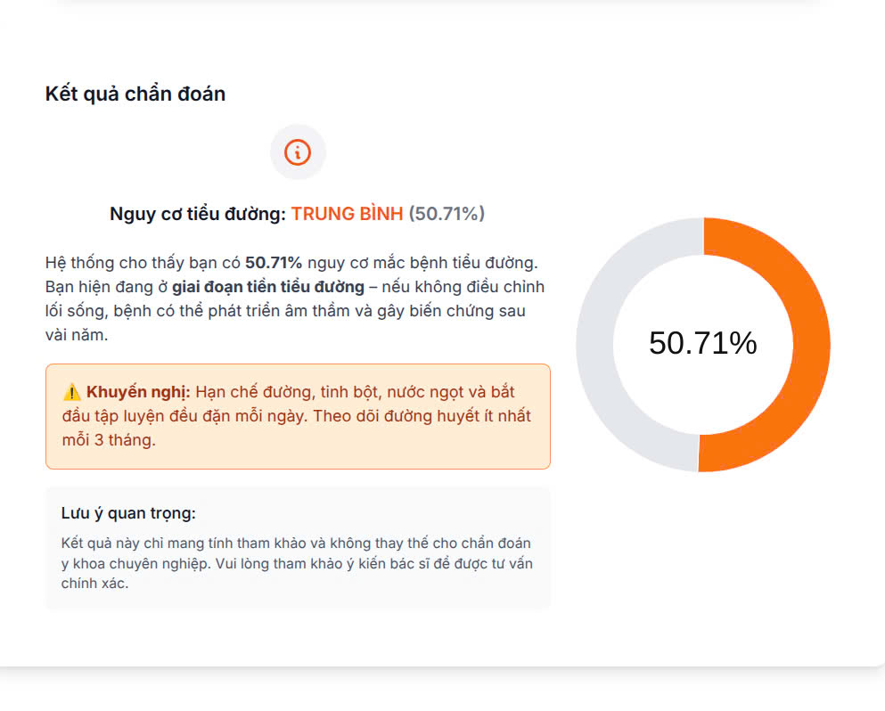
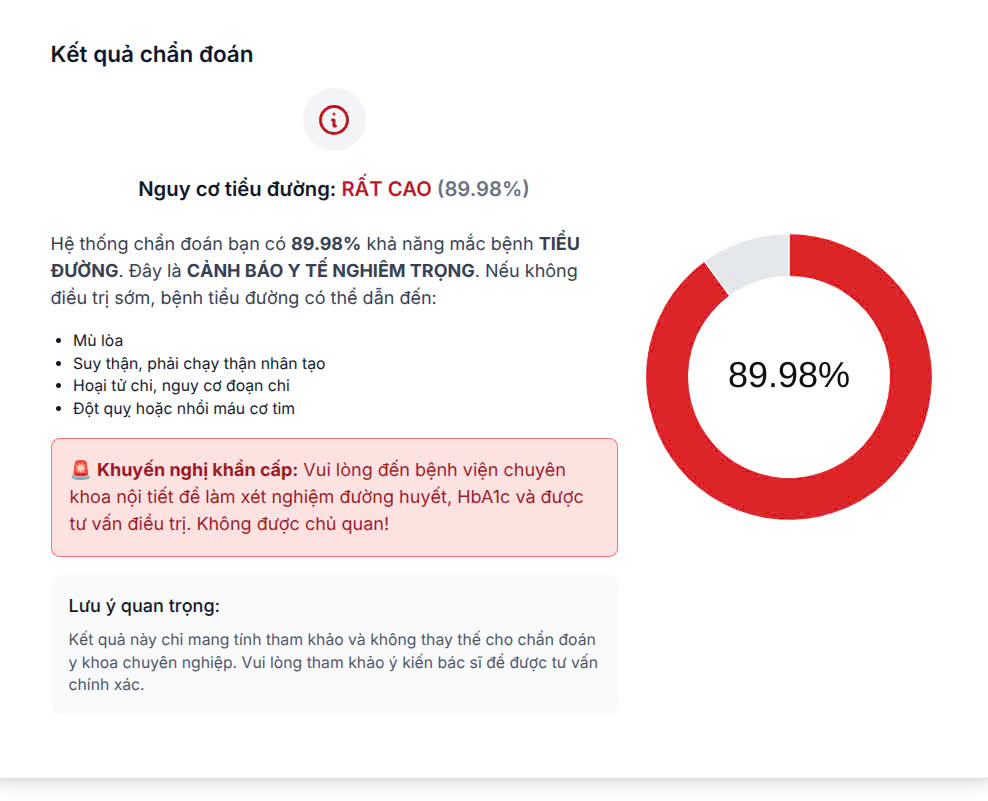

# 🩺 Medical Diagnosis System

This project is an AI-powered medical diagnosis system that helps identify potential diseases based on symptoms, test results, and patient history. It's designed to support healthcare professionals and serve as an educational tool.

## 🧠 Features

- ✅ Symptom-based disease prediction  
- ✅ Machine learning models trained on public health datasets  
- ✅ RESTful API for integration with other systems  
- ✅ User-friendly interface for patient data input  
- ✅ Visual output for diagnosis and recommendations  

## 🛠️ Tech Stack

- **Backend:** Python (Flask/FastAPI)
- **ML Libraries:** Scikit-learn, TensorFlow, Pandas
- **Frontend:** HTML/CSS (optional UI)
- **API Testing:** Postman

## 📊 Machine Learning Models

The system uses various models, including:
- Decision Trees
- Random Forest
- Support Vector Machines
- Neural Networks

## 🖼️ Screenshots
🏠 Home	

📝 Form	

✅ Green Result	

⚠️ Orange Result	

❌ Red Result

